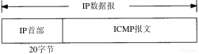

## 1 概述

### 1.3 TCP/IP 分层
 - 链路层 ARP
 - 网络层 IP(不可靠), ICMP
 - 运输层 TCP(可靠), UDP 
 - 应用层  

### 1.4 互联网的地址
 - A 类 0xxxxxxx(7位网络号).xxxxxxxx.xxxxxxxx.xxxxxxx (24位 主机号)
 - B 类 10xxxxxx.xxxxxxxx(14位网络号).xxxxxxxx.xxxxxxx (16位 主机号)
 - C 类 110xxxxx.xxxxxxxx.xxxxxxxx(21位网络号).xxxxxxx (8位 主机号)
 - D 类 1110xxxx.xxxxxxxx.xxxxxxxx.xxxxxxx (28位 多播组号)
 - E 类 11110xxx.xxxxxxxx.xxxxxxxx.xxxxxxx (27位 留着后用)

分类网络于1993年被无类别域间路由取代以解决这个问题

### 1.6 封装
当应用程序用TCP传送数据时，数据被送入协议栈中，然后逐个通过每一层直到被当作一串比特流送入网络。其中每一层对收到的数据都要增加一些首部信息（有时还要增加尾部信息）

### 1.7 分用 
就是反封装

### 1.9 端口号
16 bit的端口号来识别应用程序(2^16 个)， 类 UNIX  系统 1~1024 需要 root 权限，/etc/services 有常用服务。

## 2 链路层

### 2.1 引言
（1）为IP模块发送和接收IP数据报；
（2）为ARP模块发送ARP请求和接收ARP应答；
（3）为RARP发送RARP请求和接收RARP应答。TCP/IP支持多种不同的链路层协议，这取决于网络所使用的硬件，如以太网、令牌环网、FDDI（光纤分布式数据接口）及RS-232串行线路等。

### 2.2 以太网和IEEE 802封装
以太网和IEEE 802封装差异，还好长度一样。

 - SLIP：串行线路IP
 - 压缩的SLIP
 - PPP：点对点协议
 - 环回接口 127.0.0.1(localhost)
  - 传给环回地址（一般是127.0.0.1）的任何数据均作为IP输入。
  - 传给广播地址或多播地址的数据报复制一份传给环回接口，然后送到以太网上。
  - 任何传给该主机IP地址的数据均送到环回接口。

 - 最大传输单元MTU
 - 路径MTU
 - 串行线路吞吐量计算

## IP:网际协议

### 3.1 引言
 - 不可靠（unreliable）的意思是它不能保证IP数据报能成功地到达目的地。
 - 无连接（connectionless）这个术语的意思是IP并不维护任何关于后续数据报的状态信息。

### 3.2 IP首部
普通的IP首部长为20个字节，除非含有选项字段。

#### 服务类型（TOS）
字段包括一个3bit的优先权子字段（现在已被忽略），4bit的TOS子字段和1bit未用位但必须置0 。
4bit的TO S分别代表:最小时延、最大吞吐量、最高可靠性和最小费用.如果所有4bit均为0，那么就意味着是一般服务。RFC 1340。

#### 总长度
总长度字段是指整个IP数据报的长度，以字节为单位。  
16比特，所以IP数据报最长可达65535字节。  
尽管可以传送一个长达65535字节的IP数据报，但是大多数的链路层都会对它进行分片。而且，主机也要求不能接收超过576字节的数据报。  
但是，事实上现在大多数的实现（特别是那些支持网络文件系统NFS的实现）允许超过8192字节的IP数据报。
必要字段 ，因为一些数据链路（如以太网）需要填充一些数据以达到最小长度。

#### TTL（time-to-live）
生存时间字段设置了数据报可以经过的最多路由器数。它指定了数据报的生存时间。TTL的初始值由源主机设置（通常为32或64），一旦经过一个处理它的路由器，它的值就减去1。

#### 首部检验和字段
是根据IP首部计算的检验和码。它不对首部后面的数据进行计算。ICMP、IGMP、UDP和TCP在它们各自的首部中均含有同时覆盖首部和数据检验和码。  
 计算方式：首先把检验和字段置为0。然后，对首部中每个16 bit进行二进制反码求和（整个首部看成是由一串16 bit的字组成），结果存在检验和字段中，正常值应全为1，如 不是则丢包。
由于路由器经常只修改TTL字段（减1），因此当路由器转发一份报文时可以增加它的检验和，而不需要对IP整个首部进行重新计算。

#### 源IP地址和目的IP地址

#### 任选项
 - 安全和处理限制（用于军事领域)
 - 记录路径
 - 时间戳
 - 宽松的源站选路
 - 严格的源站选路

### 3.3 IP路由选择

主机区别于路由器是转不转发数据报文  

IP可以从TCP、UDP、ICMP和IGMP接收数据报（即在本地生成的数据报）并进行发送，或者从一个网络接口接收数据报（待转发的数据报）并进行发送。IP层在内存中有一个路由表。当收到一份数据报并进行发送时，它都要对该表搜索一次。当数据报来自某个网络接口时，IP首先检查目的IP地址是否为本机的IP地址之一或者IP广播地址。如果确实是这样，数据报就被送到由IP首部协议字段所指定的协议模块进行处理。如果数据报的目的不是这些地址，那么（1）如果IP层被设置为路由器的功能，那么就对数据报进行转发（也就是说，像下面对待发出的数据报一样处理）；否则（2）数据报被丢弃。

#### 路由表信息
 - 目的IP地址。它既可以是一个完整的主机地址，也可以是一个网络地址，由该表目中的标志字段来指定
 - 下一站（或下一跳）路由器（next-hop router）的IP地址，或者有直接连接的网络IP地址。
 - 标志。其中一个标志指明目的IP地址是网络地址还是主机地址，另一个标志指明下一站路由器是否为真正的下一站路由器，还是一个直接相连的接口
 - 为数据报的传输指定一个网络接口。

IP路由选择是逐跳地（hop-by-hop）进行的。它假定下一站路由器比发送数据报的主机更接近目的。

#### IP路由选择主要完成功能
 - 搜索路由表，寻找能与目的IP地址完全匹配的表目（网络号和主机号都要匹配）
 - 搜索路由表，寻找能与目的网络号相匹配的表目。
 - 搜索路由表，寻找标为“默认（default）”的表目。

如果不能传送的数据报来自本机，那么一般会向生成数据报的应用程序返回一个“主机不可达”或“网络不可达”的错误。
完整主机地址匹配在网络号匹配之前执行。只有当它们都失败后才选择默认路由。
为一个网络指定一个路由器，而不必为每个主机指定一个路由器，这是IP路由选择机制的另一个基本特性。这样做可以极大地缩小路由表的规模。

### 3.4 子网寻址
现在所有的主机都要求支持子网编址（RFC 950[Mogul and Postel 1985]）,主机号再分成一个子网号和一个主机号。

### 3.5 子网掩码
任何主机在引导时进行的部分配置是指定主机IP地址。
除了IP地址以外，主机还需要知道有多少比特用于子网号及多少比特用于主机号。这是在引导过程中通过子网掩码来确定的。
给定IP地址和子网掩码以后，主机就可以确定IP数据报的目的
 - 本子网上的主机
 - 本网络中其他子网中的主机；
 - 其他网络上的主机。

## 4 ARP:地址解析协议
当一台主机把以太网数据帧发送到位于同一局域网上的另一台主机时，是根据48 bit的以太网地址来确定目的接口的。设备驱动程序从不检查IP数据报中的目的IP地址。
ARP为IP地址到对应的硬件地址之间提供动态映射。

### 4.3 ARP高速缓存
ARP高效运行的关键是由于每个主机上都有一个ARP高速缓存。 高速缓存中每一项的生存时间一般为20分钟，起始时间从被创建时开始算起。

`arp -a` 查询本机的 arp
`tcpdump -e arp #-e  去掉省略网卡地址` 查看 arp 查询报文

一些特殊的功能：委托ARP（当路由器对来自于另一个路由器接口的ARP请求进行应答时）和免费ARP（发送自己IP地址的ARP请求，一般发生在引导过程中）。

## 5 RARP:逆地址解析协议
RARP协议是许多无盘系统在引导时用来获取IP地址的。RARP分组格式基本上与ARP分组一致。一个RARP请求在网络上进行广播，它在分组中标明发送端的硬件地址，以请求相应IP地址的响应。应答通常是单播传送的。

RARP带来的问题包括使用链路层广播，这样就阻止大多数路由器转发RARP请求，只返回很少信息：只是系统的IP地址。

## 6 ICMP:Internet控制报文协议
ICMP经常被认为是IP层的一个组成部分。它传递差错报文以及其他需要注意的信息。ICMP报文通常被IP层或更高层协议（TCP或UDP）使用。

ICMP报文是在IP数据报内部被传输的

所有报文的前4个字节都是一样的,类型字段可以有15个不同的值，以描述特定类型的ICMP报文。检验和字段覆盖整个ICMP报文,ICMP的检验和是必需的。

IP 协议并不是一个可靠的协议,它不保证数据被送达,那么,自然的,保证数据送达的工作应该由其他的模块来完 成。其中一个重要的模块就是 ICMP(网络控制报文)协议。

当传送 IP 数据包发生错误--比如主机不可达,路由不可达等等,ICMP 协议将会把错误信息封包,然后传送回给主机。给主机 一个处理错误的机会,这 也就是为什么说建立在 IP 层以上的协议是可能做到安全的原因。ICMP 数据包由8bit 的错误类型和8bit 的代 码和16bit 的校验和组成。而前 16bit 就组成了 ICMP 所要传递的信息。图给出了错误类型和代码的组合代表的意思。

尽管在大多数情况下,错误的包传送应该给出 ICMP 报文,但是在特殊情况下,是不产生 ICMP 错误报文的。如下:
 - ICMP 差错报文不会产生 ICMP 差错报文(出 IMCP 查询报文)(防止 IMCP 的无限产生和传送)
 - 目的地址是广播地址或多播地址的IP数据报。
 - 作为链路层广播的数据报。
 - 不是IP分片的第一片。
 - 源地址不是单个主机的数据报。这就是说,源地址不能为零地址、环回地址、广播地址或多播地址。 都是为了防止产生 ICMP 报文的无限传播而定义的。
 - ICMP 协议大致分为两类,一种是查询报文,一种是差错报文。其中查询报文有以下几种用途:
  - ping 查询
  - 子网掩码查询(用于无盘工作站在初始化自身的时候初始化子网掩码)
  - 时间戳查询(可以用来同步时间)

## 7 Ping程序
### 7.1 引言
“ping”这个名字源于声纳定位操作。 Ping程序由Mike Muuss编写，目的是为了测试另一台主机是否可达。该程序发送一份ICMP回显请求报文给主机，并等待返回ICMP回显应答。  一般来说，如果不能Ping到某台主机，那么就不能Te lnet或者FTP到那台主机。反过来，如果不能Te lnet到某台主机，那么通常可以用Ping程序来确定问题出在哪里。Ping程序还能测出到这台主机的往返时间，以表明该主机离我们有“多远”。  
随着Internet安全意识的增强，出现了提供访问控制清单的路由器和防火墙,如果不能Ping到某台主机,有可能是禁 Ping 了，协议以及端口号还是可达的。

### 7.2 Ping程序
Unix系统在实现ping程序时是把ICMP报文中的标识符字段置成发送进程的ID号。这样即使在同一台主机上同时运行了多个ping程序实例，ping程序也可以识别出返回的信息。
序列号从0开始，每发送一次新的回显请求就加1。ping程序打印出返回的每个分组的序列号，允许我们查看是否有分组丢失、失序或重复。IP是一种最好的数据报传递服务，因此这三个条件都有可能发生。

在局域网上运行ping程序的结果输出一般有如下格式：

当返回ICMP回显应答时，要打印出序列号和TTL，并计算往返时间（TTL位于IP首部中的生存时间字段。当前的BSD系统中的ping程序每次收到回显应答时都打印出收到的TTL—有些系统并不这样做。我们将在第8章中通过traceroute程序来介绍TTL的用法）。

从上面的输出中可以看出，回显应答是以发送的次序返回的（0，1，2等）。 丢包的话某些序号就会不见。

ping程序通过在ICMP报文数据中存放发送请求的时间值来计算往返时间。当应答返回时，用当前时间减去存放在ICMP报文中的时间值，即是往返时间。

### 7.3 IP记录路由选项
ping程序为我们提供了查看IP记录路由（RR）选项的机会。大多数不同版本的ping程序都提供-R选项，以提供记录路由的功能。它使得ping程序在发送出去的IP数据报中设置IPRR选项（该IP数据报包含ICMP回显请求报文）。这样，每个处理该数据报的路由器都把它的IP地址放入选项字段中。当数据报到达目的端时，IP地址清单应该复制到ICMP回显应答中，这样返回途中所经过的路由器地址也被加入清单中。当ping程序收到回显应答时，它就打印出这份IP地址清单。

这个过程听起来简单，但存在一些缺陷。源端主机生成RR选项，中间路由器对RR选项的处理，以及把ICMP回显请求中的RR清单复制到ICMP回显应答中，所有这些都是选项功能。幸运的是，现在的大多数系统都支持这些选项功能，只是有一些系统不把ICMP请求中的IP清单复制到ICMP应答中。

但是，最大的问题是IP首部中只有有限的空间来存放IP地址。我们从图3-1可以看到，IP首部中的首部长度字段只有4bit，因此整个IP首部最长只能包括15个32 bit长的字（即60个字节）。由于IP首部固定长度为20字节，RR选项用去3个字节（下面我们再讨论），这样只剩下37个字节（60-20-3）来存放IP地址清单，也就是说只能存放9个IP地址。对于早期的ARPA NET来说，9个IP地址似乎是很多了，但是现在看来是非常有限的（在第8章中，我们将用Traceroute工具来确定数据报的路由）。除了这些缺点，记录路由选项工作得很好。

## 8 Traceroute程
### 8.1 引言
由Van Jacobson编写的Traceroute程序是一个能更深入探索TCP/IP协议的方便可用的工具。尽管不能保证从源端发往目的端的两份连续的IP数据报具有相同的路由，但是大多数情况下是这样的。Traceroute程序可以让我们看到IP数据报从一台主机传到另一台主机所经过的路由。Traceroute程序还可以让我们使用IP源路由选项。

### 8.2 Traceroute程序的操作

Tr aceroute程序使用ICMP报文和IP首部中的TTL字段（生存周期）。TTL字段是由发送端初始设置一个8bit字段。推荐的初始值由分配数字RFC指定，当前值为64。较老版本的系统经常初始化为15或32。我们从第7章中的一些ping程序例子中可以看出，发送ICMP回显应答时经常把TTL设为最大值255。

每个处理数据报的路由器都需要把TTL的值减1或减去数据报在路由器中停留的秒数。由于大多数的路由器转发数据报的时延都小于1秒钟，因此TTL最终成为一个跳站的计数器，所经过的每个路由器都将其值减1。
	
操作过程
---

Traceroute 的原理是非常非常的有意思,它收到目的主机的 IP 后,首先给目的主机发送一个 TTL=1(还记得 TTL 是什么吗?)的 UDP(后面就 知道 UDP 是什么了)数据包,而经过的第一个路由器收到这个数据包以后,就自动把 TTL 减1,而 TTL 变为0以后,路由 器就 丢弃该数据报，并发回一份超时ICMP报文。这样就得到了该路径中的第一个路由器的地址。然后Traceroute程序发送一份TTL值为2的数据报，这样我们就可以得到第二个路由器的地址。继续这个过程直至该数据报到达目的主机。但是目的主机哪怕接收到TTL值为1的IP数据报，也不会丢弃该数据报并产生一份超时ICMP报文，这是因为数据报已经到达其最终目的地。那么我们该如何判断是否已经到达目的主机了呢？
Traceroute程序发送一份UDP数据报给目的主机，但它选择一个不可能的值作为UDP端口号（大于30 000），使目的主机的任何一个应用程序都不可能使用该端口。因为，当该数据报到达时，将使目的主机的UDP模块产生一份“端口不可达”错误（见6.5节）的ICMP报文。这样，Traceroute程序所要做的就是区分接收到的ICMP报文是超时还是端口不可达，以判断什么时候结束。

## 9 IP选路
### 9.1 引言
需要进行选路的数据报可以由本地主机产生，也可以由其他主机产生。在后一种情况下，主机必须配置成一个路由器，否则通过网络接口接收到的数据报，如果目的地址不是本机就要被丢弃（例如，悄无声息地被丢弃）。

在Unix系统中，大多数普通的守护程序都是路由程序和网关程序（术语daemon指的是运行在后台的进程，它代表整个系统执行某些操作。daemon一般在系统引导时启动，在系统运行期间一直存在）。

 查看路由表可以使用命令 `route`  或者 `netstat -nr`

### 9.2 选路的原理
IP搜索路由表的几个步骤：
---
 - 搜索匹配的主机地址
 - 搜索匹配的网络地址
 - 搜索默认表项（默认表项一般在路由表中被指定为一个网络表项，其网络号为0）

IP层进行的选路实际上是一种选路机制，它搜索路由表并决定向哪个网络接口发送分组。这区别于选路策略，它只是一组决定把哪些路由放入路由表的规则。IP执行选路机制，而路由守护程序则一般提供选路策略。

#### 简单路由表
`netstat -nr` 
!()[./_images/route-net-nr.png]
第1行说明，如果目的地是140.252.13.65（slip主机），那么网关（路由器）将把分组转发给140.252.13.35（bsdi）。这正是我们所期望的，因为主机slip通过SLIP链路与bsdi相连接，而bsdi与该主机在同一个以太网上。

对于一个给定的路由器，可以打印出五种不同的标志（flag）：
 - U 该路由可以使用
 - G 该路由是到一个网关（路由器）。如果没有设置该标志，说明目的地是直接相连的
 - H 该路由是到一个主机，也就是说，目的地址是一个完整的主机地址。如果没有设置该标志，说明该路由是到一个网络，而目的地址是一个网络地址：一个网络号，或者网络号与子网号的组合
 - D 该路由是由重定向报文创建的（9.5节）
 - M 该路由已被重定向报文修改（9.5节）。

标志G区分了间接路由和直接路由（对于直接路由来说是不设置标志G的）,发往直接路由的分组中不但具有指明目的端的IP地址，还具有其链路层地址,当分组被发往一个间接路由时，IP地址指明的是最终的目的地，但是链路层地址指明的是网关（即下一站路由器）。

#### IP 选路的方式 
 - 首先用IP地址来匹配那些带H标志的DestinationIP地址。
 - 如果1失败就匹配那些网络地址。
 - 如果2失败就发送到Default网关

一般,我们在配置好一个网络接口的时候,一个路由就被直接创建好了。当然我们也可以手动添加路由。用 route add 命令就可以了。而当一个 IP 包在某一个路由器的时候发现没有路由可走,那么该路由器就会给源主机发送“主机不可达”或者“网络不可达”的 ICMP包来报错。

注意,一般的操作系统默认是没有路由功能的,这需要自己配置。

#### ICMP 的 IP 重定向报文和路由发现报文
当 IP 包在某一个地方转向的时候,都回给发送 IP 报的源主机一个 ICMP 重定向报文,而源主机就可以利用这个信息来更新自己的路由表,这样,随着网络通信的逐渐增多,路由表也就越来越完备,数据转发的速度也会越来越快。我们需要注意的是:
 - 重定向报文只能由路由器发出。
 - 重定向报文为主机所用,而不是为路由器所用。

在主机引导的时候,一般会发送在网内广播一个路由请求的 ICMP 报文,而多个路由器则会回应一个路由通告报文。而且,路由其本身不定期的在网络内发 布路由通告报文,这样,根据这些报文,每一个主机都会有机会建立自己的路由表而实现网络通信。路由 器在一份通告报文中可以通告多个地址,并且给出每一个地 址的优先等级,这个优先等级是该 IP 作为默认路由的等级。

路由器一般会在450-600秒的时间间隔内发布一次通告,而一个给定的通告报文的寿命是30分钟。而主机在引导的时候会每三秒发 送一次请求报文,一旦接受到一个有效的通告报文,就停止发送请求报文。在 TCP/IP 详解编写的时候,只有 Solaris2.x 支持这两种报文,大多数系统还不支持这两种报文。(后面还会讲到一些有用的路由 报文)

## 10 动态选路协议
前面的选路方法叫做静态选路,简要地说就是在配置接口的时候,以默认的方式生成路由表项。并通过 route 来增加表项,或者 通过 ICMP 报文来更新表项(通常在默认方式出错的情况下)。 而如果上诉三种方法都不能满足,那么我们就使用动态选路。

动态选路协议是用于动态选路的重要组成部分,但是他们只是使用在路由器之间,相邻路由器之间互相通信。系统(路有选择程 序)选择比较合适的路有放到 核心路由表中,然后系统就可以根据这个核心路有表找到最合适的网路。也就是说,动态选路是在系统 核心网络外部进行的,它只是用一些选路的策略影响路由表, 而不会影响到最后通过路由表选择路由的那一部分。选路协议有一大类 常用的叫做内部网关协议(IGP),而在 IGP 中,RIP 就是其中最重要的协议。一种新 的 IGP 协议叫做开放最短路经优先(OSPF)协议,其意在取代 RIP。另一种最早用在网路骨干网上的 IGP 协议--HELLO,现在已经不用了。如今,任何支持动态选路的路由器都必须同时支持 OSPF 和 RIP,还可以选择性的支持其他的 IGP 协议

### Unix 选路程序

Unix 系统上面通常都有路由守护程序--routed。还有一个叫做 gate。gate 所支持的协议要比 routed 多,routed 只是支持 RIPv1
版本。而 gate 则支持 RIPv1、v2,BGPv1 等等。

### RIP:选路信息协议

它的定义可以在 RFC1058内找到,这种协议使用 UDP 作为载体(也就是 UDP 的上层协议)。我们最关心的就是 RIP 其中的一个段,叫做度量的 段,这是一个以 hop 作为计数器(就是以走过多少路由为计数器)的段(IP 协议里面也有一个 TTL 不是么)。这个度 量段将最终影响到路由表的建立。
!()[./_images/dy-route-rip.png]

一般说来 routed 要承担如下的工作
---
 - 给每一个已知的路由器发送 rip 请求报文,要求其他路由器给出完整的路由表。这种报文的命令字段为1,地址字段为0,度量 地段为16(相当于无穷大)。
 - 接受请求,如果接收到刚才的那个请求,就把自己的完整的路由表交给请求者。如果没有,就处理 IP 请求表项,把表项中自 己有的部分添上跳数,没有的部分添上16。然后发给请求者。
 - 接受回应。更新自己的路由表。使用 hop 数小的规则。
 - 定期更新路由表,一般是30s(真频繁)给相邻的路有启发一次自己的路由表。这种形式可以使广播形式的。

这个协议看起来会工作的很好,但是,这里面其实有很多隐藏的忧患,比如说 RIP 没有子网的概念,比如说环路的危险。而且 hop数的上限也限制了网络的大小。因此,出现了很多 RIPv1的替代品,比如说 RIPv2,比如说 OSPF。他们都是通过某种策略来影响路由表

